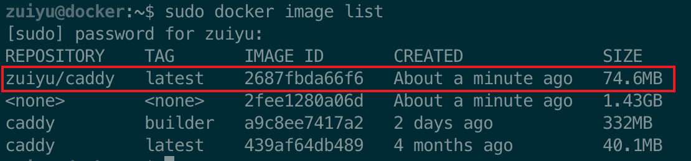

# 编译自己的 caddy

使用 docker 来编译自己的 caddy

```dockerfile
FROM caddy:builder AS builder
RUN xcaddy build --with github.com/caddy-dns/dnspod --with github.com/mholt/caddy-webdav

FROM caddy:latest
COPY --from=builder /usr/bin/caddy /usr/bin/caddy
```

打开命令行，进行编译

```shell
docker build -t zuiyu/caddy .
```

> 由于需要用到 go 去下载相关资源，所以建议全程科学上网

等待执行完毕后，我们查看下结果

```shell
docker image list
```


